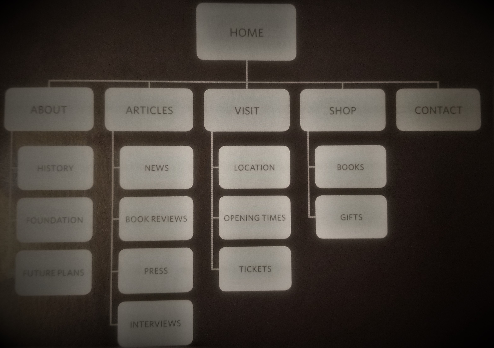

# Process & Design

> There are so many considerations when designing a website...

    - Who is it for?
    - What are they trying to gain?
    - What do they need to know to get it?
> A site being designed for a company is ususally much differently built than a website produced for the general public or even a specific demographic. Should it be proffesional looking or should it have a fun feel?

> Either way when somenone visits your page they are looking for something, you must give them what they want in the most efficient way you can, while at the same time maintaining an appropriate and intuitive feel.

## Site Map
> A site map is a way to organize your thoughts on the design of your site. It is the "pre-write" for designing websites.

## Wireframe
> The wireframe is the bare bones skeleton of the website. This is when you ask yourself how do you want the site to look? Once you have an idea sketched up, start coding it up in HTML

## Visual Considerations
- What is the visual hierarchy on your page?
    1. Pictures showing the product is the first thing eyes turn to on a website
    2. The headline explaining what the product is comes next.
- Other variables include...
    - Grouping
    - Proximity
    - Closure
    - Continuance
    - White Space
    - Color and Borders

[Table of Contents](README.md)