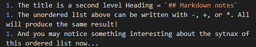

## Markdown notes

### What is Markdown

> Markdown is a very simple way to style text while working on GitHub. It works on comments in GitHub and also any files with an .md extension.

### Here are some examples of MD syntax
- **Bold** = `**Bold**`
- *italic* = `*italic*`
- ***bold and italic!*** = `*** bold and italic! ***`

> Of course above are a few good examples you might not have noticed...
1. The title is a second level Heading = `## Markdown notes`
1. The unordered list above can be written with -, +, or *. All will produce the same result!
1. And you may notice something interesting about the sytnax of this ordered list now...

> In an ordered list on Markdown you may put any number as the key, but a proper ordered list will always be displayed from that. The benefit of this is if you have a very long ordered list and you remove an item the  entire list will adjust automatically!

[Table of Contents](README.md)

