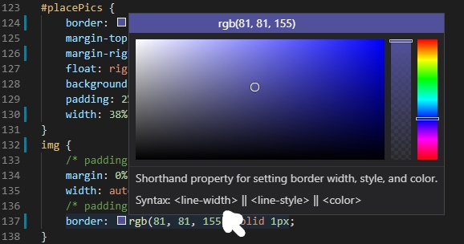

# Text, Color, and Img in CSS
## Text

Here a list of ways to manipulate text in CSS with the corredpanding code...
(assume these key value pairs are inserted inside a css selector already.)
- Change the font Family, which is the same as changing the font however if the user does not have the first font in the family installed on their computer then it will default to the next font and so on.
    - `font-family: Georgia, Times, serif;`

- change font size, so with font size you can either use px for pixel or % to set the size. When you use % it will be based off of the fonts original size, 16. So 50% would turn your font to 8px...
    - `font-size: 75%`

- turn font bold
    - `font-weight: bold;`

- turn font italic
    - `font-style: italic;`

- turn font uppercase
    - `text-transform: uppercase;`

- turn font lowercase
    - `text-transform: lowercase;`

- capitalize the first letter in each word
    - `text-transform: capitalize;`    

- underline text
    - `text-decoration: underline;`
    - same syntax for `overline` and `line-through`

## Color
color can bring your page to life, here are some ways to integrate color into your css...

- font color
    - `color: red;`

- background color, and this refers to your current box not neccesarily the entire pages background.
    - `background-color: red;`

The easiest way to find a new cool color is to use the color picker mechanic in CSS. Maybe its not the moost efficient way but personally I just like to choose any old color, then once it is set hover over it in the CSS file and a color picker will appear for you to choose any color you want... Example below.

## Images in Html

Adding images into HTML is easy, the tricky part is deciding where exactly it should go. Keep in mind where you will want it on the page and dont just throw the img tag in haphazardly. for instance if you would want it to go in between some text of the same content consider actually putting the img between the sentences describing it in your `
` tag. Or if you want it after the text put it at the end, before the text put the img at the start, etc...

### Syntax for adding images into HTML

Lets consider this example.

``

1. the entire tag is actually one self closing tag, no need for another closing tag.
2. you must declare your source, `src="insert img location here"
3. the alt is for accessibility and screen readers.
4. and lastly ive set my height for the img to 100 pixels. The reason i did not set a width is so that the width would scale automatically so as to not distort my image.